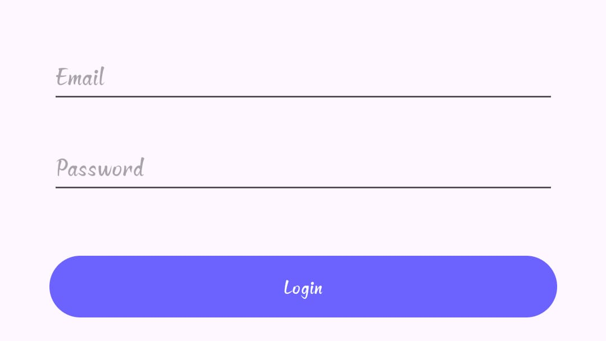
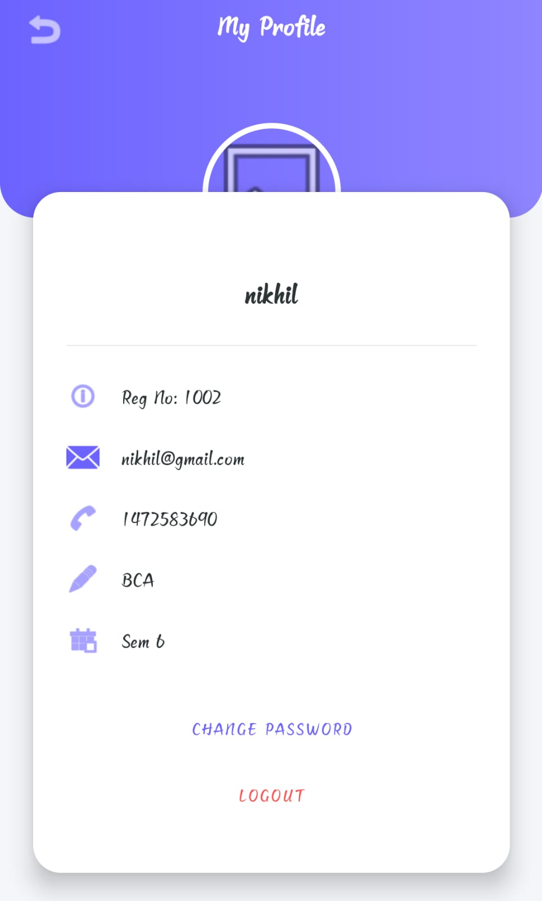
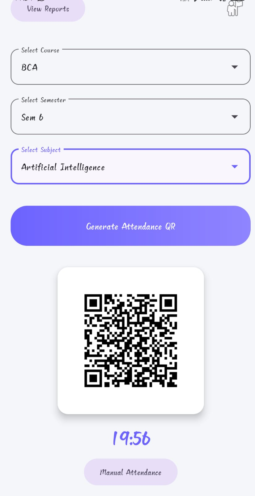
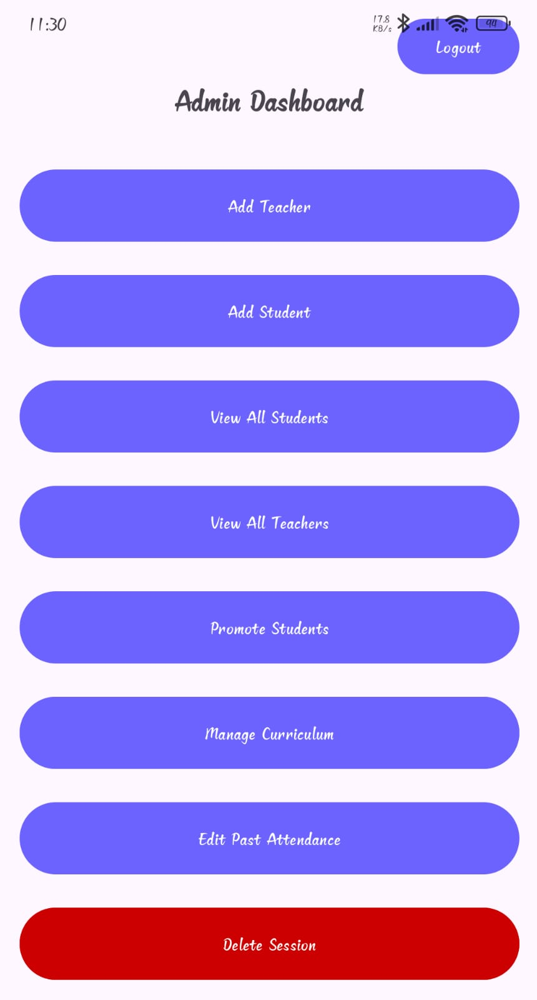
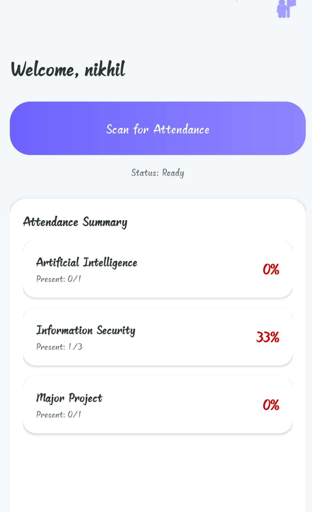
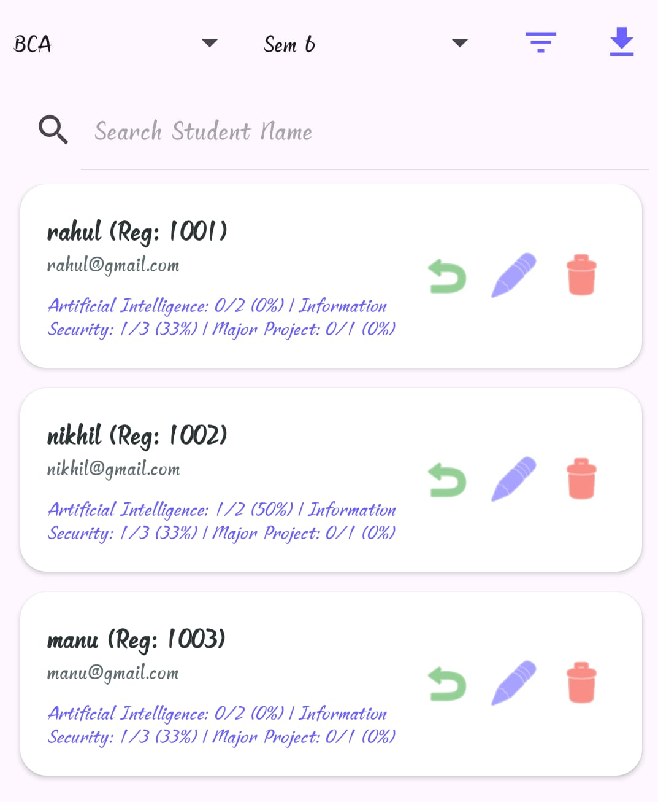

# 📱 Qron - Smart QR Attendance System

**Qron** is a secure, location-based Android application designed to streamline the attendance process for colleges using QR Code technology and GPS geofencing. It includes a powerful Admin panel, Offline capabilities, and System Logging via Google Sheets.

---

## 🚀 Key Features

### 👨‍🏫 For Teachers
- **Dynamic QR Generation:** Generates unique QR codes for specific subjects and sessions.
- **Offline Mode:** Works seamlessly even without internet; data syncs automatically when online.
- **Real-time Status:** View active sessions and connection status (Online/Offline indicator).

### 👨‍🎓 For Students
- **Scan & Mark:** Scan the teacher's QR code to mark attendance.
- **GPS Geofencing:** Ensures students are physically present in the class (works without internet via GPS).
- **Device Lock:** Binds the account to a specific device (Single Device Login) to prevent proxy attendance.

### 🛠 For Admin
- **Full Control:** Add/Edit Courses, Semesters, and Subjects dynamically from the app.
- **System Logs:** All critical actions (Delete Student, Edit Attendance, Device Reset) are logged to **Google Sheets** for transparency.
- **Manage Users:** Reset device locks, delete students, or manually update attendance.
- **Excel Export:** Download logs and attendance reports.

---

## 💻 Tech Stack
- **Language:** Java
- **Database:** Firebase Realtime Database / Cloud Firestore
- **Location Services:** Google Play Services Location API
- **External API:** Google Sheets API for logging

---

## 📸 Screenshots

  
  
  

  
  
  

---

## ⚙️ Setup Instructions
1. Clone the repository: `git clone https://github.com/ugrashen7459/Qron.git`
2. Open the project in Android Studio.
3. Sync Gradle and build the project.
4. Add your `google-services.json` file for Firebase integration.
5. Run the app on an emulator or physical device.

---

## 📄 License
This project is licensed under the MIT License.
